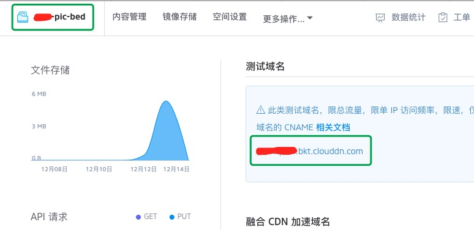
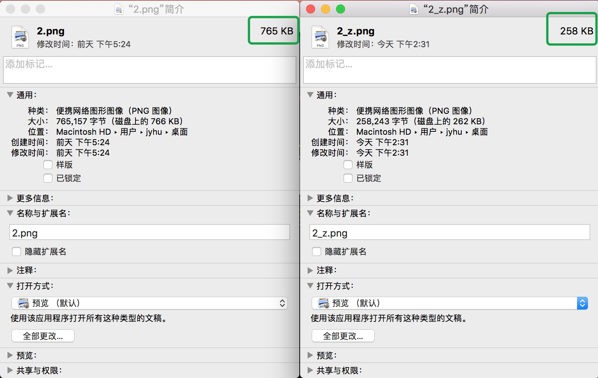

# markdown文件中图片到图床的转换

在以前写`markdown`文件的时候，关于用到最多的是**[围脖图床](http://weibotuchuang.sinaapp.com)**，给我解决了图片引用的大问题。但是每次都需要自己手动的去上传图片，然后再md中用。更为糟心的是后来在`Chorme`中又不准用它，而在`Safari`里的使用又不是很友好。
于是乎，就萌生了自己做一个自动上传替换的脚本。借用一些现有的很不错的工具，转换效果还是很好的。

## 需要用到的工具

### 环境

依然使用的是还算了解一些的`Python3`，关于它，还是看下**[这里](http://www.auu.space/2016/10/13/升级Mac自带的python/#more)**，我这里使用的是Mac系统。

其中还需要几个开源库，可以使用pip安装，pip获取方式可以根据**[官网的教程文档](https://pip.pypa.io/en/stable/installing/)**获取安装。

### 懒人看的

如果不想看下面几个，内容，在安装好`pip`以后，直接执行这几条命令就行了。

```
pip install --upgrade requests
pip install --upgrade tinify
pip install --upgrade qiniu
```

### 存储

在开始的时候，看过一些资料，都是用微博作为图床的比较多，没有上传限制、流量限制等，但是做起来可能相对要复杂一些，然后还有的人用的七牛，然后看了官方的文档还是很简单的，**[这是官方的开发文档](http://developer.qiniu.com/code/v7/sdk/python.html)**，免费的云存储空间和流量够个人使用了。

申请好个人账号，然后找到以下几个参数：

先到个人信息里找到找到ak和sk，然后在对象存储里找到空间名称、域名



### 图片压缩

由于七牛空间有限，为了节省空间，所以需要对图片做些压缩优化，这里使用的是`tinypng`做图片的压缩，**[官方的文档](https://tinypng.com/developers/reference/python)**。

随便找了个张图片压缩对比一下，还是很客观的：




### 图片地址缓存

为了避免重复上传，所以在本地还做了一个缓存，用压缩后图片的`hash`值作为存储的`key`，然后保存下当前图片的网址，下次再上传相同图片的时候，可以通过图片的`hash`值，来找到已上传的地址，避免重复上传。

## 使用

老样子：

python 脚本名 文件名 [是否图片压缩]

例： `python ~/Dropbox/useful_script/Scripts/md文件图片图床转换/md_transfer.py ~/Desktop/t.md 0`

* 0 - 不需要压缩
* 1 - 需要压缩，注意`tiniPNG`的`key`

**代码写的乱，如有问题，欢迎留言 ~**

* 下面算是一个流程图吧，将就着看吧。


## 注意

这些重要的参数不要忘了哦 ~ 

```
ak = ''		# ak
sk = ''		# sk
domain = '' # 上传域名
bucket = '' # 空间名称
tinify.key = '' # 设置tinipng的key
```
