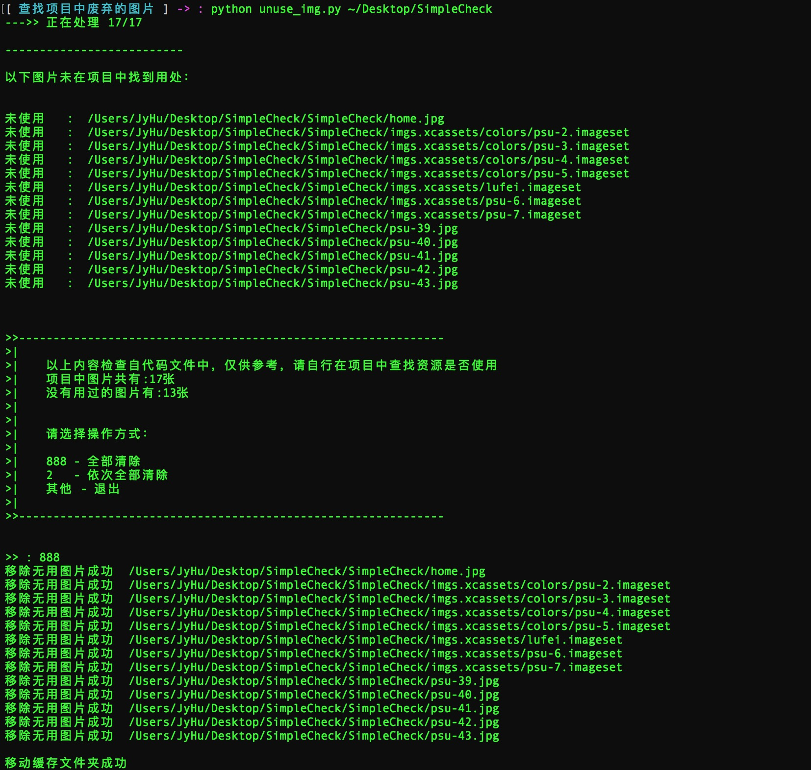
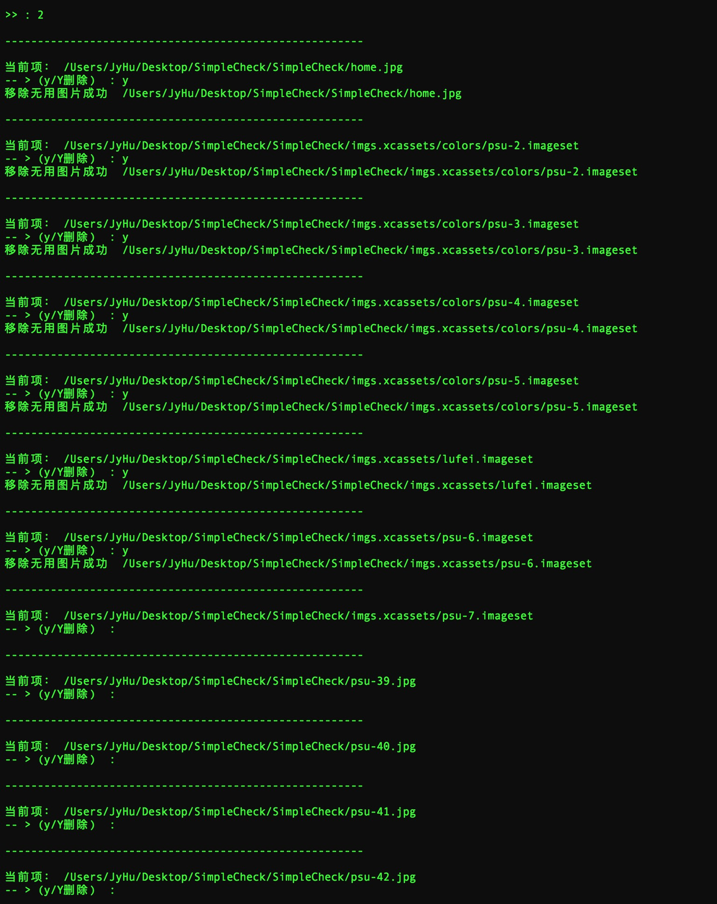
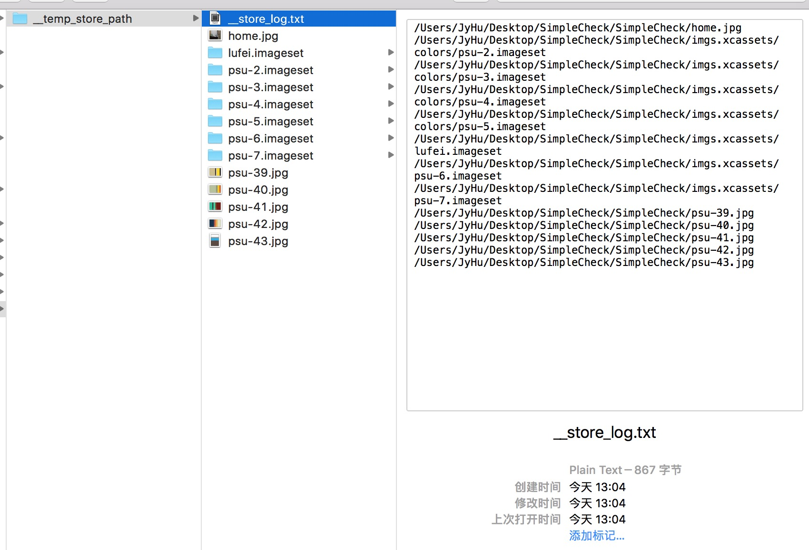

# 查找项目中废弃的图片

主要是因为在开发的时候，有些图片放在XCode项目中，但是在版本迭代的时候，经常无法及时的删除无用的图片，所以，长时间的积累的话，肯定会造成项目的越来越臃肿。

脚本可以清理项目中的无用的图片，并将清理掉的内容写到缓存起来，以备查看。

测试了几个项目，效果还不错。

## 使用

python 脚本路径 项目路径 [过滤目录,过滤目录...]

例：

`python unuse_img.py  /Users/JyHu/Dropbox/Project/ios ThirdParts,Expression,GifFace`

# 最新更新

- 过滤掉注释的内容
- 提供删除无用图片的选项

# 测试

* 自动全部清空

* 一个个选择性的清理

* 缓存的清理内容

