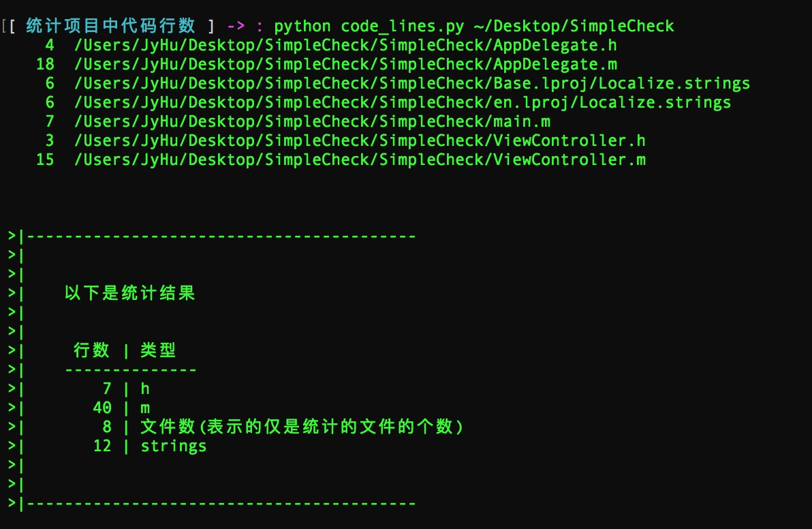
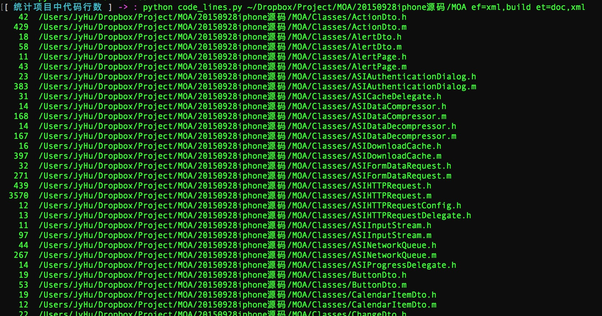
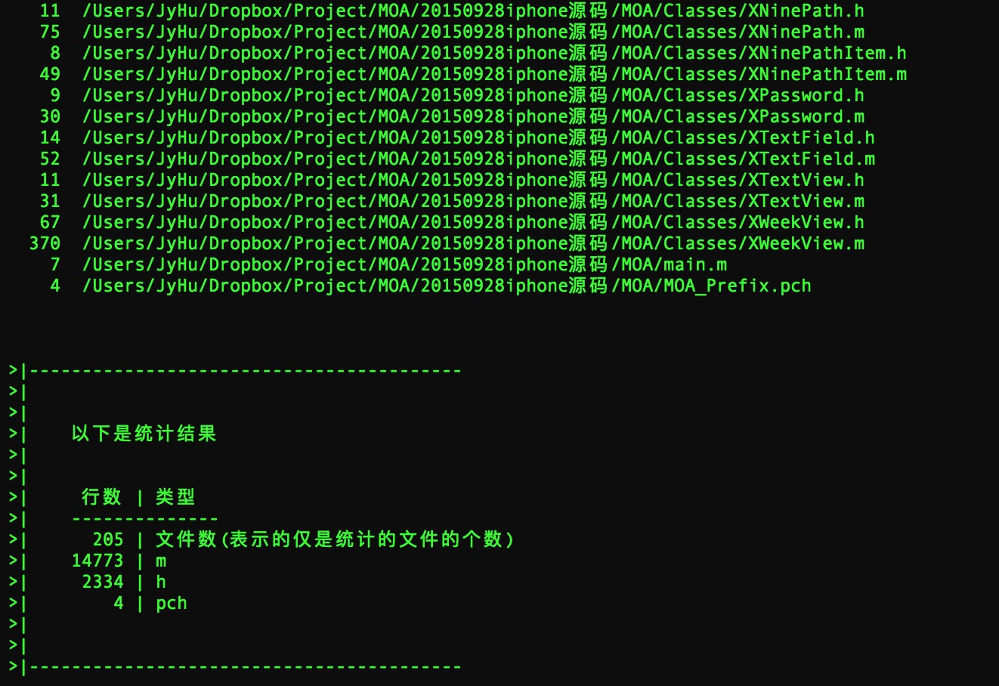

#统计项目中有效代码的行数

简单的用与统计项目中的有效代码行数，即去掉注释、空行以外的代码行数。

现在主要是统计XCode项目中的代码行数，自动的过滤以下文件、文件夹：

* 过滤的文件类型有：

```
origin_type = ('bundle', 'framework', 'xcworkspace', 'xcodeproj', 'a', 'plist', 'xcassets', 'storyboard', 'xib', 'nib', 'entitlements', 'ttf', 'json', 'swf', 'avi', 'mp4', 'mov')
```

还有能够识别的图片文件。

* 过滤的文件夹有

```
origin_folder = ('Podfile', 'Pods')
```

还有隐藏文件夹是必须过滤掉的。


当然，每个人需要过滤掉的文件类型还有文件夹可能会各不相同，下面的使用中，可以自己选择需要过滤的内容。


# 使用

`python 项目路径 et=m1,m2,m3 ef=f1,f2,f3`

* `et`表示的是要过滤掉的文件类型，可以跟多个，以半角`,`隔开即可。非必须使用。
* `ef`表示的是要过滤掉的文件夹名，可以跟多个，以半角`,`隔开即可。非必须使用。

如果不附带参数也可以，会按照默认的过滤类型过滤。

例：

`python code_lines.py ~/Dropbox/Project/ios ef=ThirdParts,Expression,GifFace et=md,pch`

下面是两个使用的例子

* 项目1，随便新建的一个项目



* 项目2，随便找了个一个项目开刀


